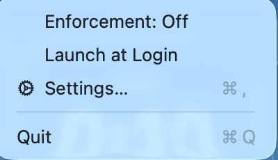
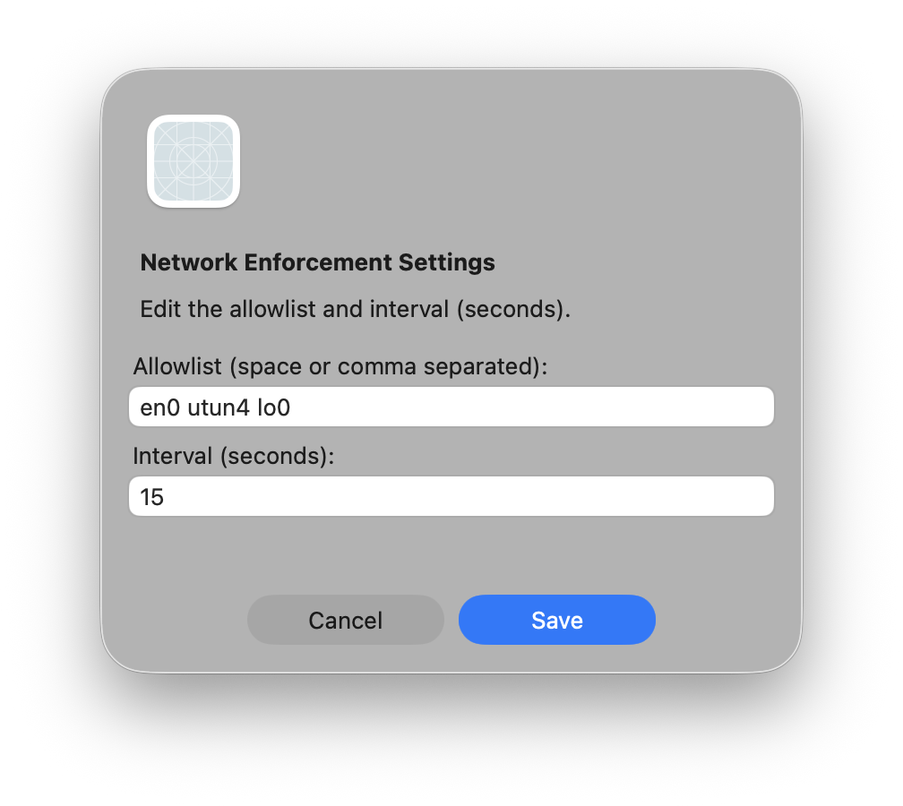
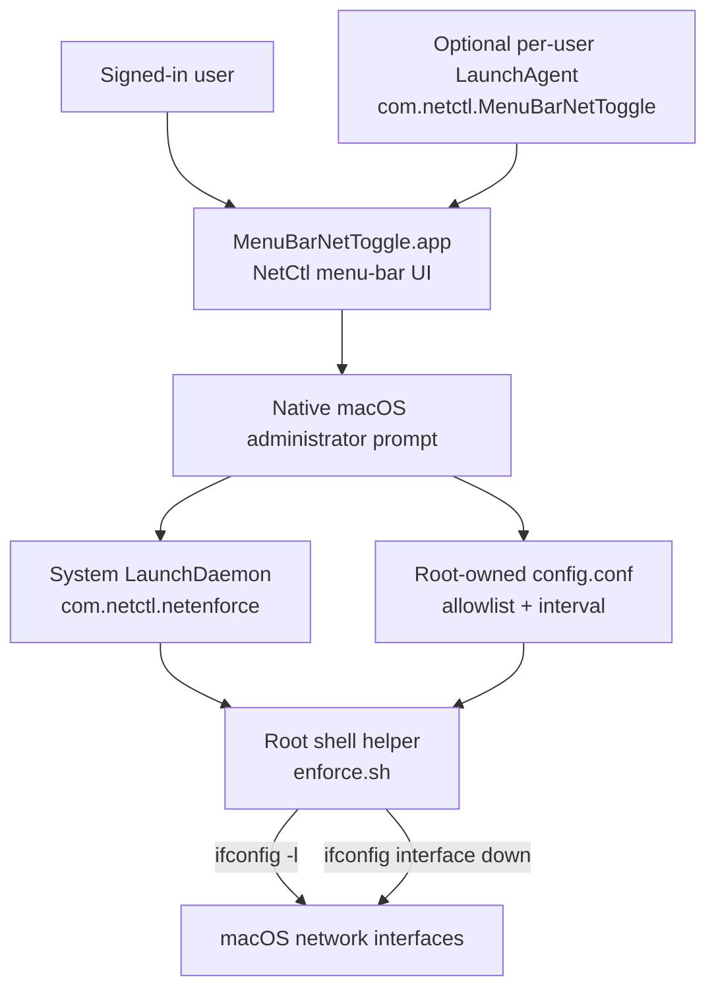

# Interface Sentinel

### Native macOS network-interface allowlist enforcement from the menu bar


> [!CAUTION]
> Interface Sentinel can immediately disconnect Wi-Fi, Ethernet, VPNs, virtual machines, AirDrop, Continuity, device sharing, and remote administration when a required interface is missing from the allowlist. Identify the interfaces your Mac needs before enabling enforcement, keep `lo0` allowed, and test first on a non-critical Mac with a local recovery path.

Interface Sentinel is a small native macOS menu-bar utility that continuously keeps every network interface down except the interfaces you explicitly allow. The menu-bar application appears as **NetCtl** and manages a root-owned LaunchDaemon that enforces the allowlist at a configurable interval.

The project is deliberately narrow:

> Interface Sentinel controls whether an interface may remain up. It does not inspect, filter, classify, or attribute traffic carried by that interface.

---

## Table of Contents

- [Overview](#overview)
- [Executive Summary](#executive-summary)
- [Screenshots](#screenshots)
- [Architecture](#architecture)
- [Capabilities and Boundaries](#capabilities-and-boundaries)
- [Requirements](#requirements)
- [Quick Start](#quick-start)
- [Detailed Installation](#detailed-installation)
- [Configure the Allowlist](#configure-the-allowlist)
- [Operate Interface Sentinel](#operate-interface-sentinel)
- [Verify a Running Installation](#verify-a-running-installation)
- [Recovery](#recovery)
- [Update](#update)
- [Uninstall Completely](#uninstall-completely)
- [Troubleshooting](#troubleshooting)
- [Security and Privacy Model](#security-and-privacy-model)
- [Repository Structure](#repository-structure)
- [Development and Verification](#development-and-verification)
- [Responsible Use](#responsible-use)
- [License](#license)

---

## Overview

macOS creates network interfaces for physical hardware, tunnels, peer-to-peer networking, virtualization, sharing services, and other system features. Interface Sentinel applies a simple host-level policy to those interfaces:

```text
Enumerate every interface -> compare it with the allowlist -> bring every non-allowed interface down -> wait -> repeat
```

When enforcement is enabled, Interface Sentinel installs and starts a root-owned LaunchDaemon named `com.netctl.netenforce`. Its helper enumerates interfaces with `ifconfig -l` and runs:

```sh
/sbin/ifconfig "<interface>" down
```

for each interface absent from the configured allowlist.

The default source configuration is:

```text
ALLOWLIST="en0 utun4 lo0"
INTERVAL=15
```

These values are examples, not a safe universal configuration. Hardware-port names vary between Macs, and `utun` numbers can change as VPNs and Apple networking services start and stop.

---

## Executive Summary

- Native Swift and Cocoa menu-bar application for macOS 13 or later.
- Continuous interface allowlist enforcement at a configurable 1–3600 second interval.
- Root-owned LaunchDaemon for enforcement independent of the signed-in user session.
- Administrator authorization through the native macOS prompt when privileged files or service state must change.
- Menu-bar indicator for the helper's observed running state.
- Settings UI for space- or comma-separated interface names.
- Duplicate interface removal and input validation before privileged configuration writes.
- Optional per-user LaunchAgent to start the menu-bar application at sign-in.
- No third-party runtime dependencies, packet capture, network upload, telemetry, or cloud service.
- Complete verification, recovery, update, troubleshooting, and uninstall procedures below.

### Direct capability vs. interpretation

| Type | What Interface Sentinel provides |
| --- | --- |
| **Direct capability** | Repeatedly enumerates local interfaces with `ifconfig -l`. |
| **Direct capability** | Brings every interface not present in the allowlist down with `ifconfig <name> down`. |
| **Direct capability** | Stores enforcement configuration in a root-owned local file. |
| **Direct capability** | Runs enforcement as a system LaunchDaemon independently of the menu-bar UI. |
| **Direct capability** | Optionally starts the user-facing app at login with a per-user LaunchAgent. |
| **Status boundary** | `NetCtl ●` means the PID recorded by the helper refers to a live process; it is not cryptographic proof of helper identity or proof that every interface is currently down. |
| **Policy boundary** | An allowed interface may carry any destination, application, protocol, or content. Interface Sentinel is not a per-app or per-destination firewall. |
| **Attribution boundary** | An unexpected interface is not by itself evidence of compromise; macOS, VPNs, virtualization, sharing, and security tools can create interfaces legitimately. |

---

## Screenshots

The screenshots were captured from the repository's locally built Cocoa application in a documentation-only launch with enforcement disabled. They use the source defaults and contain no private network capture, host inventory, credential, or device identifier.

### Menu-bar controls



The menu exposes four focused actions:

- **Enforcement: On/Off** installs, starts, or stops the privileged helper after administrator authorization.
- **Launch at Login** creates or removes the per-user LaunchAgent.
- **Settings…** edits the allowlist and enforcement interval.
- **Quit** exits only the menu-bar application; it does not stop an active system LaunchDaemon.

### Allowlist and interval settings



The sample values in the screenshot are the source defaults. Do not copy them without first identifying the required interfaces on the target Mac.

---

## Architecture



### Installed components

```text
User session
  /Applications/MenuBarNetToggle.app
  ~/Library/LaunchAgents/com.netctl.MenuBarNetToggle.plist   (optional)

System session
  /Library/LaunchDaemons/com.netctl.netenforce.plist
  /Library/Application Support/MenuBarNetToggle/enforce.sh
  /Library/Application Support/MenuBarNetToggle/config.conf
  /var/run/com.netctl.netenforce.pid
  /var/log/com.netctl.netenforce.out
  /var/log/com.netctl.netenforce.err
```

The two process lifecycles are intentionally independent:

- Launch at Login can be enabled while enforcement is off.
- Enforcement can remain active after the menu-bar application quits.
- Logging out stops the user application, but the system LaunchDaemon can remain active.
- Reopening the menu-bar application reconnects the UI to the helper's observed state.

---

## Capabilities and Boundaries

### What it does

- Enumerates all interface names returned by `/sbin/ifconfig -l`.
- Compares each exact interface name with the configured allowlist.
- Administratively brings non-allowed interfaces down.
- Repeats enforcement at the configured interval.
- Reloads the configuration file on each pass, so saved changes are used by the running helper without rebuilding the app.
- Keeps the helper alive through launchd when enforcement is enabled.
- Validates UI input before writing privileged configuration:
  - allowlist cannot be empty;
  - names can contain letters, numbers, `.`, `_`, `:`, and `-`;
  - duplicate names are removed;
  - interval must be between 1 and 3600 seconds.
- Displays `NetCtl ○` when the helper is not observed running and `NetCtl ●` when its recorded PID is live.

### What it does not do

- It does not inspect, capture, decrypt, proxy, or export packets.
- It does not identify which process created or uses an interface.
- It does not determine whether an interface is malicious.
- It does not restrict traffic on an allowed interface.
- It does not configure the macOS Application Firewall, Packet Filter (`pf`), Network Extension policies, DNS, routes, or proxies.
- It does not automatically discover a safe allowlist.
- It does not automatically follow changing `utun` numbers.
- It does not automatically bring an interface back up after enforcement stops.
- It does not stop the root helper when the menu-bar application quits.
- It does not include an updater, Developer ID signature, notarization ticket, or universal binary.
- It does not send interface information or telemetry to a remote service.

---

## Requirements

- macOS 13 Ventura or later.
- Apple silicon (`arm64`) or Intel (`x86_64`) Mac; the build targets the architecture of the Mac performing the build.
- Xcode or Xcode Command Line Tools with `swiftc` and the macOS SDK.
- An administrator account to enable enforcement or change the privileged configuration.
- Local interactive access during initial configuration and testing.

Check the required developer tools:

```sh
xcode-select -p
xcrun --find swiftc
xcrun --sdk macosx --show-sdk-path
swiftc --version
```

If the Command Line Tools are missing, request Apple's installer:

```sh
xcode-select --install
```

---

## Quick Start

```sh
git clone https://github.com/hideouts-io/Interface-Sentinel.git
cd Interface-Sentinel
./build.sh
ditto build/MenuBarNetToggle.app /Applications/MenuBarNetToggle.app
open /Applications/MenuBarNetToggle.app
```

Then:

1. Open **NetCtl → Settings…**.
2. Replace the example allowlist with interface names verified on the current Mac.
3. Save the configuration and approve the native administrator prompt.
4. Select **Enforcement: Off** to enable enforcement.
5. Immediately confirm that required local and network access still works.

> [!IMPORTANT]
> Do not enable enforcement over the only SSH, Screen Sharing, VPN, or remote-management path to the Mac. A missing interface can sever the connection needed to recover it.

---

## Detailed Installation

### 1. Clone the repository

```sh
git clone https://github.com/hideouts-io/Interface-Sentinel.git
cd Interface-Sentinel
```

### 2. Review the privileged behavior

Interface Sentinel intentionally performs root-level network-interface changes. Review the complete source before running it:

```sh
less main.swift
less build.sh
plutil -p Info.plist
```

The enforcement script and LaunchDaemon are generated from `main.swift` only after enforcement is enabled.

### 3. Build

```sh
./build.sh
```

The build script:

1. Resolves the active macOS SDK.
2. Compiles `main.swift` with Apple's Swift compiler and Cocoa framework.
3. Creates `build/MenuBarNetToggle.app`.
4. Applies a local ad-hoc signature.
5. Performs strict code-signature verification.

The generated app targets macOS 13 or later and the current Mac's architecture. It is not universal, Developer ID signed, or notarized for third-party distribution.

### 4. Verify the build

```sh
codesign --verify --deep --strict --verbose=2 build/MenuBarNetToggle.app
codesign -d --verbose=4 build/MenuBarNetToggle.app
file build/MenuBarNetToggle.app/Contents/MacOS/MenuBarNetToggle
plutil -lint build/MenuBarNetToggle.app/Contents/Info.plist
```

### 5. Install the application

Quit any older copy first. The public project name is Interface Sentinel, while the current bundle and executable retain the internal name `MenuBarNetToggle`.

```sh
ditto build/MenuBarNetToggle.app /Applications/MenuBarNetToggle.app
```

If the current account cannot write to `/Applications`, elevate only the copy operation:

```sh
sudo ditto build/MenuBarNetToggle.app /Applications/MenuBarNetToggle.app
```

Verify the installed copy:

```sh
codesign --verify --deep --strict --verbose=2 /Applications/MenuBarNetToggle.app
```

### 6. Launch

```sh
open /Applications/MenuBarNetToggle.app
```

Look for `NetCtl ○` or `NetCtl ●` in the menu bar. Interface Sentinel is an agent-style application (`LSUIElement`) and does not normally appear in the Dock.

Do not enable enforcement until the allowlist has been reviewed for this Mac.

---

## Configure the Allowlist

### Inventory the current Mac

Use read-only commands to identify interface names and their current roles:

```sh
ifconfig -l
networksetup -listallhardwareports
route -n get default
scutil --nwi
```

For a more detailed read-only view:

```sh
for interface_name in $(ifconfig -l); do
  echo "===== $interface_name ====="
  ifconfig "$interface_name"
done
```

Review the output locally. A complete interface inventory can reveal hardware, VPN, virtualization, and network-service details that may not belong in a public issue or screenshot.

### Common interface families

| Interface | Common role | Allowlist guidance |
| --- | --- | --- |
| `lo0` | Local loopback | Normally keep allowed. Many local services depend on it. |
| `en0`, `en1`, … | Wi-Fi, Ethernet, adapters, or other hardware ports | Confirm the mapping with `networksetup -listallhardwareports`; do not assume the name. |
| `utun0`, `utun1`, … | VPN tunnels and some Apple networking services | Allow only when required. Numbers are not stable across sessions. |
| `bridge0` | Software bridge, Internet Sharing, or virtualization | Allow only when the associated feature is required. |
| `awdl0` | Apple Wireless Direct Link used by AirDrop and Continuity features | Blocking it can disable peer-to-peer Apple features. |
| `llw0` | Low-latency Apple wireless interface | Blocking it can affect nearby-device and Continuity behavior. |
| `ap1` | Apple wireless access-point or sharing behavior on some systems | Confirm its current purpose before deciding. |
| `stf0`, `gif0` | Tunnel interface types | Keep blocked unless a verified workflow requires them. |

Interface names are only identifiers. Their presence does not prove malicious activity, and a familiar name does not prove safe use.

### Save settings

Open **NetCtl → Settings…** and provide:

- **Allowlist:** interface names separated by spaces or commas.
- **Interval:** an integer from 1 to 3600 seconds.

Saving requires administrator authorization because the configuration is written to:

```text
/Library/Application Support/MenuBarNetToggle/config.conf
```

The file is set to `root:wheel` ownership with mode `0644`. The running helper reads it again on every enforcement pass.

### Choosing an interval

- A short interval reduces the time an unexpected interface may remain up but increases command activity and reduces recovery time after a mistake.
- A longer interval reduces enforcement frequency but leaves a wider window before a new interface is brought down.
- The default is 15 seconds.

The interval is not a guarantee of exact timing; launchd scheduling, system load, and the helper loop can affect when a pass completes.

---

## Operate Interface Sentinel

### Status indicator

| Indicator | Meaning |
| --- | --- |
| `NetCtl ○` | The PID record does not identify a currently live process. |
| `NetCtl ●` | The helper's recorded PID is currently live and enforcement is treated as active. |

The UI refreshes periodically and whenever the menu opens.

### Enable enforcement

1. Confirm local recovery access.
2. Open **NetCtl**.
3. Select **Enforcement: Off**.
4. Review and approve the macOS administrator prompt.
5. Confirm the menu changes to **Enforcement: On** and `NetCtl ●`.
6. Immediately test required Wi-Fi, Ethernet, VPN, local-service, sharing, and administrative workflows.

On first enable, the app creates or rewrites the root-owned configuration, helper script, and LaunchDaemon, then bootstraps the daemon in the system launchd domain.

### Disable enforcement

1. Open **NetCtl**.
2. Select **Enforcement: On**.
3. Approve the administrator prompt.
4. Confirm `NetCtl ○` and verify the system service is absent.

Disabling enforcement prevents future passes. It does not restore interfaces already brought down.

### Launch at login

Select **NetCtl → Launch at Login** to create:

```text
~/Library/LaunchAgents/com.netctl.MenuBarNetToggle.plist
```

The LaunchAgent records the exact path of the running application. Install the app in `/Applications` before enabling this option so the path remains stable.

Launch at Login starts the user interface. It is separate from system enforcement and does not determine whether the root LaunchDaemon continues running.

### Quit

**Quit** terminates only the menu-bar application. It does not unload `com.netctl.netenforce` or restore disabled interfaces.

---

## Verify a Running Installation

### Application process

```sh
pgrep -alf MenuBarNetToggle
```

If Launch at Login is enabled, inspect its user service:

```sh
launchctl print "gui/$(id -u)/com.netctl.MenuBarNetToggle"
```

An error is expected when the LaunchAgent is disabled or not loaded.

### System enforcement service

```sh
launchctl print system/com.netctl.netenforce
```

Inspect the active configuration and PID record:

```sh
cat "/Library/Application Support/MenuBarNetToggle/config.conf"
cat /var/run/com.netctl.netenforce.pid
```

### Ownership and permissions

```sh
ls -la "/Library/Application Support/MenuBarNetToggle"
ls -l /Library/LaunchDaemons/com.netctl.netenforce.plist
```

Expected privileged files are owned by `root:wheel`. The helper script is executable; the configuration and LaunchDaemon property list are not.

### Current interface state

```sh
for interface_name in $(ifconfig -l); do
  ifconfig "$interface_name" | sed -n '1p;/status:/p'
done
```

An interface without the `UP` flag is administratively down or otherwise inactive. Interface state alone does not prove Interface Sentinel caused it; correlate the state with the LaunchDaemon, configuration, PID, and timestamps.

### Logs

The helper writes standard output and standard error to:

```text
/var/log/com.netctl.netenforce.out
/var/log/com.netctl.netenforce.err
```

Inspect recent entries without changing the files:

```sh
sudo tail -n 100 /var/log/com.netctl.netenforce.out
sudo tail -n 100 /var/log/com.netctl.netenforce.err
```

Empty logs are normal when helper commands complete without producing output.

---

## Recovery

### Stop the helper first

Use **NetCtl → Enforcement: On** to turn enforcement off, or unload the exact system service from Terminal:

```sh
sudo launchctl bootout system/com.netctl.netenforce
```

Confirm it is gone:

```sh
launchctl print system/com.netctl.netenforce
```

The expected result is an error stating that the service could not be found.

### Restore a verified interface

The safest general recovery is macOS **System Settings → Network**, where the required service can be reconnected using its human-readable name.

If the exact interface has been positively identified, bring only that interface up:

```sh
sudo ifconfig en0 up
```

Replace `en0` with the verified interface name for the current Mac. If service state remains inconsistent, toggle the affected network service in System Settings or restart the Mac after confirming the helper is unloaded.

### Remote lockout warning

If enforcement disabled the only remote-administration interface, recovery requires a separate path such as local keyboard/display access, another already-working management channel, or a planned restart with the helper removed or unloaded. Do not rely on the same network path that the policy is capable of disabling.

---

## Update

1. Turn enforcement off if interface changes should pause during the update.
2. Turn Launch at Login off if the existing LaunchAgent points to another app location.
3. Quit Interface Sentinel.
4. Pull, rebuild, and verify.
5. Replace the installed application.
6. Reopen the app and re-enable only the intended settings.

```sh
git pull --ff-only
./build.sh
codesign --verify --deep --strict --verbose=2 build/MenuBarNetToggle.app
sudo ditto build/MenuBarNetToggle.app /Applications/MenuBarNetToggle.app
open /Applications/MenuBarNetToggle.app
```

Replacing the `.app` does not automatically remove the existing root helper or configuration. Enabling enforcement from the rebuilt application rewrites those privileged files using the current configuration.

---

## Uninstall Completely

Deleting the `.app` is not sufficient after enforcement or Launch at Login has been enabled.

### 1. Disable services from the menu

Turn **Enforcement** off, turn **Launch at Login** off, and choose **Quit**.

### 2. Remove any remaining user LaunchAgent

```sh
if launchctl print "gui/$(id -u)/com.netctl.MenuBarNetToggle" >/dev/null 2>&1; then
  launchctl bootout "gui/$(id -u)/com.netctl.MenuBarNetToggle"
fi
rm -f "$HOME/Library/LaunchAgents/com.netctl.MenuBarNetToggle.plist"
```

### 3. Remove the exact privileged components

```sh
if launchctl print system/com.netctl.netenforce >/dev/null 2>&1; then
  sudo launchctl bootout system/com.netctl.netenforce
fi
sudo rm -f /Library/LaunchDaemons/com.netctl.netenforce.plist
sudo rm -f /var/run/com.netctl.netenforce.pid
sudo rm -f /var/log/com.netctl.netenforce.out
sudo rm -f /var/log/com.netctl.netenforce.err
sudo rm -rf "/Library/Application Support/MenuBarNetToggle"
```

These paths are created by Interface Sentinel. Removing the application-support directory permanently deletes its configuration.

### 4. Remove the application

```sh
sudo rm -rf /Applications/MenuBarNetToggle.app
```

If the source checkout is no longer needed, its generated build directory can be removed separately from inside that checkout:

```sh
rm -rf build
```

### 5. Verify removal

```sh
pgrep -alf MenuBarNetToggle
launchctl print system/com.netctl.netenforce
test ! -e "$HOME/Library/LaunchAgents/com.netctl.MenuBarNetToggle.plist"
test ! -e /Library/LaunchDaemons/com.netctl.netenforce.plist
test ! -e "/Library/Application Support/MenuBarNetToggle"
```

The process search should return no application process, `launchctl print` should report that the service is absent, and the `test` commands should produce no output and exit successfully.

---

## Troubleshooting

### `NetCtl` does not appear

```sh
pgrep -alf MenuBarNetToggle
open /Applications/MenuBarNetToggle.app
```

If the process exits, run the executable from Terminal to observe immediate diagnostics:

```sh
/Applications/MenuBarNetToggle.app/Contents/MacOS/MenuBarNetToggle
```

### The administrator prompt was cancelled

Cancellation produces AppleScript authorization error `-128`. No requested privileged change is completed. Reopen the menu and repeat the operation only when ready.

### Enforcement remains on after quitting

This is expected. The system LaunchDaemon is independent of the menu-bar application. Reopen the app and disable enforcement, or unload the exact service:

```sh
sudo launchctl bootout system/com.netctl.netenforce
```

### A VPN stopped working

Disable enforcement first. Identify the VPN's current tunnel interface with `scutil --nwi` and the VPN application's own diagnostics. Add only the confirmed interface before re-enabling enforcement. Do not assume a previously observed `utun` number is still correct.

### AirDrop, Continuity, or sharing stopped working

Disable enforcement and verify whether the workflow requires `awdl0`, `llw0`, `bridge0`, `ap1`, or another dynamically created interface. Enabling those features may create more than one interface.

### Wi-Fi or Ethernet remains unavailable

Stopping the helper prevents future enforcement passes but does not reverse previous `ifconfig ... down` commands. Reconnect the service in System Settings or bring the verified interface up manually after confirming the helper is unloaded.

### Settings save but behavior does not change immediately

The helper reads the configuration on each pass. Wait for the configured interval, then inspect the config file and helper state. Do not repeatedly enable enforcement while diagnosing.

### The build fails

```sh
xcode-select -p
xcrun --sdk macosx --show-sdk-path
xcrun --find swiftc
swiftc --version
```

If Xcode was moved or replaced, select the installation actually present on the Mac:

```sh
sudo xcode-select --switch /Applications/Xcode.app/Contents/Developer
```

### `launchctl print` reports that the service is absent

That is expected when the relevant LaunchAgent or LaunchDaemon is disabled. If the UI claims enforcement is active, inspect the PID file, running process, and daemon logs together rather than relying on a single signal.

---

## Security and Privacy Model

### Privilege boundary

- The menu-bar application runs as the signed-in user.
- Privileged operations use a native macOS administrator authorization prompt.
- The LaunchDaemon and helper run as root because arbitrary interface state changes require elevated privileges.
- The helper, configuration, and daemon property list are written with `root:wheel` ownership.
- The configuration is sourced by a root shell. Do not make it writable by untrusted users or processes.

### Code-signing boundary

`build.sh` applies a local ad-hoc signature and verifies bundle integrity. Ad-hoc signing does not establish publisher identity, Developer ID trust, notarization, or App Store review.

### Status boundary

The PID file is a lightweight liveness mechanism. A live PID is not proof that the process is the expected helper, that the latest enforcement pass succeeded, or that all non-allowed interfaces remain down. Use launchd state, process details, configuration, logs, and interface state together when assurance matters.

### Privacy

Interface Sentinel has no telemetry or cloud integration and does not capture packet contents. Its local configuration and diagnostic output can still expose:

- interface names and installed network capabilities;
- VPN or tunnel presence;
- virtualization or sharing features;
- application paths in the LaunchAgent;
- usernames contained in home-directory paths;
- host-specific process IDs and timestamps.

Before opening a public issue, redact private paths, usernames, device identifiers, IP addresses, endpoint inventories, VPN details, and unrelated log content. Do not publish a complete `ifconfig`, `scutil --nwi`, LaunchAgent, or LaunchDaemon dump without reviewing it first.

### Design limitations

- The project uses AppleScript authorization and generated shell/launchd files instead of a hardened `SMAppService` or XPC privileged-helper architecture.
- The stop and status model is intentionally lightweight.
- An allowlist entry is an exact interface-name match, not a stable identity tied to hardware or a service.
- Dynamic interfaces can appear under different names after reconnects or restarts.
- An attacker or root process with sufficient privileges can modify interface state outside this application's control.
- Interface enforcement is not a substitute for firewall policy, endpoint security, network monitoring, or incident-response investigation.

---

## Repository Structure

```text
Interface-Sentinel/
├── .gitignore
├── Info.plist
├── README.md
├── build.sh
├── evidence/
│   ├── interface-sentinel-menu.png
│   └── interface-sentinel-settings.png
└── main.swift
```

| Path | Purpose |
| --- | --- |
| `.gitignore` | Excludes generated local build artifacts. |
| `main.swift` | Menu-bar UI, configuration validation, privileged helper generation, launchd management, and login-item management. |
| `build.sh` | Native Swift compilation, app-bundle creation, ad-hoc signing, and strict signature verification. |
| `Info.plist` | Bundle identity, version, executable, macOS agent-app behavior, and display properties. |
| `evidence/` | Sanitized project-specific screenshots used by this README. |
| `build/` | Generated local bundle and module cache; excluded from version control. |

The project has no third-party runtime dependencies or package manager.

---

## Development and Verification

Build and validate the repository:

```sh
./build.sh
plutil -lint Info.plist
plutil -lint build/MenuBarNetToggle.app/Contents/Info.plist
codesign --verify --deep --strict --verbose=2 build/MenuBarNetToggle.app
file build/MenuBarNetToggle.app/Contents/MacOS/MenuBarNetToggle
git diff --check
```

Changes affecting allowlist validation, launchd domains, privileged paths, quoting, file ownership, helper lifecycle, or uninstall behavior require real macOS integration testing. A compile-only check cannot validate launchd and interface behavior.

Test enforcement on a non-critical Mac with direct local access. Do not test over the only network path to the system.

---

## Responsible Use

Use Interface Sentinel only on Macs you own or are explicitly authorized to administer. Bringing interfaces down can interrupt users, monitoring, backups, remote management, business applications, and safety-critical communications.

Treat an unexpected interface as an investigation lead, not a conclusion. Establish its source and purpose with corroborating system, process, configuration, and network evidence before labeling it unauthorized or malicious.

---

## License

Interface Sentinel is released under the [MIT License](LICENSE).
